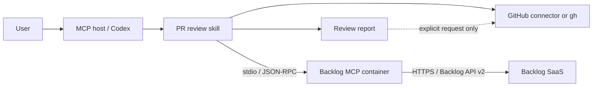
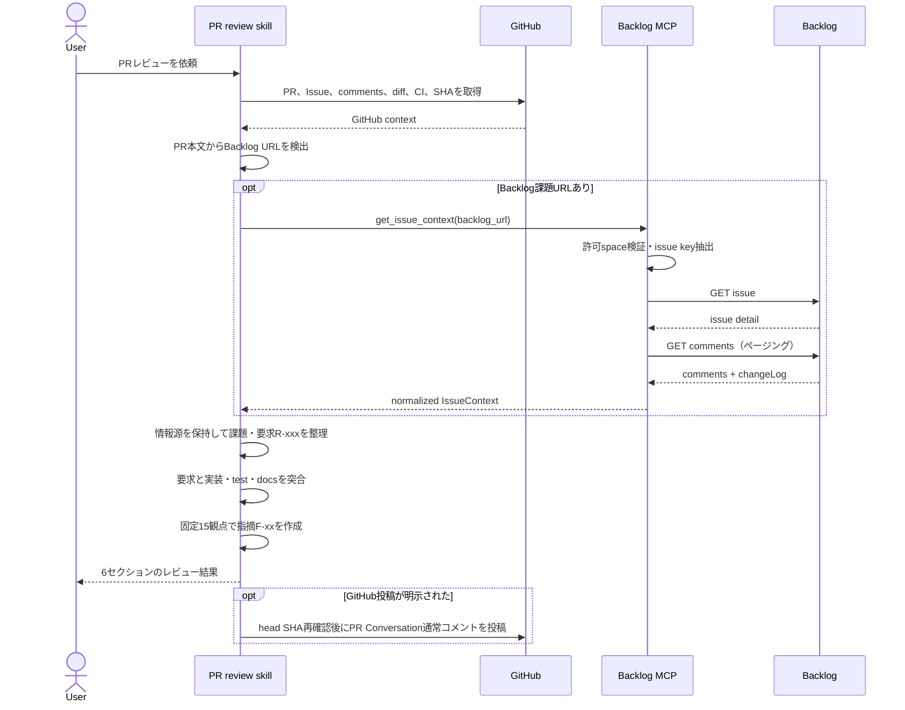

# Backlog連携PRレビュー・アーキテクチャ

## 1. 目的とスコープ

GitHub Pull Requestの説明と実装差分だけでなく、PRが参照するBacklog課題の本文、コメント、変更履歴を要求の根拠として統合し、固定15観点でレビューする。

初期スコープでは、Backlog MCPは読み取り専用の `get_issue_context` だけを公開する。課題更新、コメント投稿、添付ファイル取得、Wiki・Git操作、GitHubへの書き込みはBacklog MCPの責務に含めない。GitHubへのレビュー投稿はPRレビュースキルがユーザーの明示依頼を確認した場合だけ行う。

## 2. システム構成



### 責務境界

| コンポーネント | 責務 | 責務外 |
| --- | --- | --- |
| PRレビュースキル | GitHub情報取得、Backlog URL検出、要求統合、15観点レビュー、出力整形 | Backlog APIの認証・HTTP詳細 |
| Backlog MCP | 課題キー検証、API呼び出し、ページング、正規化、secret除去、構造化エラー | PR解釈、コードレビュー、GitHub投稿 |
| Backlog API client | HTTPS、認証、timeout、response DTO、rate-limit情報の取得 | 要求の意味解釈、MCP schema |
| GitHub連携 | PR、Issue、diff、review、CIの取得と明示時の投稿 | Backlogデータの取得 |

## 3. レビュー処理フロー



### 詳細手順

1. repository、PR番号、base/head SHAを確定し、PR本文、関連GitHub Issue、discussion、diff、CIを取得する。
2. PR本文と直接参照されたGitHub Issue本文だけからBacklog URLを検出する。
3. Backlog URLごとに `get_issue_context(backlog_url)` を1回呼ぶ。
4. MCPがURLのscheme・host・portを `BACKLOG_BASE_URL` と完全一致させ、`/view/<issue-key>` から内部用課題キーを抽出して課題詳細と設定上限までのコメントを取得する。
5. MCPはコメントの`changeLog`を分離し、取得件数、切り詰め有無、partial状態、sanitized warningを含む正規化結果を返す。
6. スキルはPR、GitHub Issue、Backlog本文、comment、changeLogの出所を保持したまま要求を `R-001` から採番する。
7. 要求と実装、test、設定、docsを突合し、固定15観点をすべて判定する。
8. 指摘を `must`、`question`、`suggestion`、`nitpick` と重大度で分類し、要求IDと双方向に対応付ける。
9. プレビューモードではチャットだけに表示する。投稿モードではhead SHAの不変を確認してGitHub PR Conversationへ1件の通常コメントとして投稿する。

## 4. Backlog MCPツール契約

### Input

```json
{
  "backlog_url": "https://your-space.backlog.jp/view/PROJECT-123"
}
```

利用者とPRレビュースキルは課題キーを組み立てず、PRに記載されたBacklog URLを渡す。MCPが設定済みoriginと`/view/<issue-key>`形式を検証し、Backlog API clientには抽出済み課題キーだけを渡す。

### Output

```json
{
  "issue": {
    "id": 12345,
    "key": "PROJECT-123",
    "project_id": 100,
    "summary": "...",
    "description": "...",
    "status": "...",
    "priority": "...",
    "issue_type": "...",
    "assignee": null,
    "parent_issue_id": null,
    "custom_fields": [],
    "categories": [],
    "versions": [],
    "milestones": [],
    "created_at": "...",
    "updated_at": "..."
  },
  "comments": [],
  "change_logs": [],
  "relationships": {
    "parent": null,
    "children": [],
    "related": []
  },
  "retrieval": {
    "source_url": "...",
    "retrieved_at": "...",
    "comment_count": 0,
    "comments_truncated": false,
    "children_truncated": false,
    "related_issues_truncated": false,
    "partial": false,
    "warnings": []
  }
}
```

Backlog APIの課題詳細 `GET /api/v2/issues/:issueIdOrKey` とコメント一覧 `GET /api/v2/issues/:issueIdOrKey/comments` を内部で使用する。コメントは古い順に正規化し、API上のページ順を要求の優先順位として扱わない。

### Errorとpartial result

主課題のURL検証または取得に失敗した場合は、API keyやrequest URLを含まないsanitized exceptionとしてMCP tool呼び出しを失敗させる。コメント、親課題、子課題、関連課題の取得失敗は主課題を失敗させず、`retrieval.partial = true`と`retrieval.warnings`の`source`・error class名で返す。rate-limitのreset時刻はclient内の例外では保持するが、現在のtool outputには公開しない。

| 内部分類 | 条件 | retry方針 |
| --- | --- | --- |
| `BacklogUrlError` | 許可外origin、path、課題キー形式 | retryしない |
| `BacklogUnauthorizedError` | API keyが無効 | retryしない |
| `BacklogForbiddenError` | 課題・projectを閲覧できない | retryしない |
| `BacklogNotFoundError` | 課題が存在しない | retryしない |
| `BacklogRateLimitedError` | Backlog APIが429を返した | MCP内部で長時間待機しない |
| `BacklogTimeoutError` | Backlog APIがtimeout | MCP内部でretryしない |
| `BacklogTransportError` | 通信失敗または想定外HTTP status | MCP内部でretryしない |
| `BacklogSchemaError` | invalid JSONまたは想定schemaと異なる | retryせず、本文をログへ出さない |

## 5. 現在のディレクトリ構成

PRレビュースキル、Backlog MCPサーバー、検証用Laravelアプリを独立した単位として管理する。各コメントは、そのファイルまたはディレクトリの責務を表す。

```text
mcp-pr-review/
├── .agents/                                      # Codexが利用するPRレビュー手順と参照資料を管理する。
│   └── skills/
│       └── pr-review/                            # GitHubとBacklogを統合するレビューskillを定義する。
│           ├── SKILL.md                          # レビュー全体の必須手順と安全な投稿条件を定義する。
│           ├── agents/
│           │   └── openai.yaml                   # skill一覧に表示する名前・説明・既定promptを定義する。
│           └── references/                       # 必要時だけ読み込む詳細ルールを責務別に分割する。
│               ├── review-checklist.md           # 省略しない固定15観点と判定基準を定義する。
│               ├── severity-and-labels.md        # must等のラベルと重大度を別軸で定義する。
│               ├── report-template.md            # チャットとGitHubで共通のレビュー形式を定義する。
│               ├── github-pr-workflow.md         # GitHub情報取得・SHA固定・重複防止・投稿を定義する。
│               ├── posting-rules.md              # PR Conversationを標準とする投稿方式とfallbackを定義する。
│               ├── review-context-workflow.md    # 複数情報源から要求とトレーサビリティを作成する。
│               └── backlog-review-workflow.md    # Backlog URL検証・取得・履歴解釈・失敗時動作を定義する。
├── .codex/
│   └── config.toml                               # Docker化したBacklog MCPのstdio起動設定を保持する。
├── mcp-server-backlog/                           # Backlog読み取り専用MCPを独立したPython projectとして管理する。
│   ├── src/backlog_mcp/                          # MCP、application、Backlog API adapter、設定を実装する。
│   ├── tests/                                    # unit、stdio integration、sanitized fixtureを管理する。
│   ├── scripts/                                  # 実APIとstdio MCPの手動probeを提供する。
│   ├── Dockerfile                                # development/runtimeの最小Python imageを作成する。
│   ├── compose.yaml                              # ローカル開発とCodex向けstdio起動を定義する。
│   ├── pyproject.toml                            # Python version、直接依存、pytest設定を集約する。
│   ├── .env.example                              # secret値を含めず必要な環境変数名だけを示す。
│   ├── .dockerignore                             # secret、VCS、cacheをbuild contextから除外する。
│   ├── .gitignore                                # secret、virtualenv、test生成物を除外する。
│   └── README.md                                 # MCPサーバー単体の構築、設定、検証方法を説明する。
├── sample-app/                                   # PRレビューのE2E確認に使うLaravel applicationを管理する。
│   ├── Dockerfile                                # Laravel開発用の最小PHP imageを作成する。
│   ├── compose.yaml                              # sample appのローカル実行環境を定義する。
│   └── README.md                                 # sample appの準備と起動方法を説明する。
├── docs/
│   └── architecture.md                           # 処理フロー、責務分離、現行構成、テスト方針を説明する。
├── AGENTS.md                                     # リポジトリ全体の編集・レビュー方針を定義する。
└── README.md                                     # 目的、現在の状態、主要文書への入口を提供する。
```

## 6. Pythonパッケージ設計

`mcp-server-backlog/src/backlog_mcp/` は、次の責務で分割する。

```text
mcp adapter -> application -> backlog adapter
bootstrap/config -> mcp adapter + application + backlog adapter
```

- `application` はBacklog clientのProtocolに依存し、具体的なHTTP clientを直接生成しない。
- `backlog` はHTTP、URL検証、response DTO、分類済みerrorを扱い、MCPの型を返さない。
- `mcp` はHTTP statusやBacklog responseを解釈せず、application resultを公開toolとして返す。
- `__main__.py` だけがconfig、client、use case、serverを組み立てる。

Pythonは公式MCP Python SDK v2を利用し、transportは初期段階ではstdioだけを有効にする。1回の未cache取得では1つの`httpx.AsyncClient`を共有し、課題・コメント・関連情報の取得完了時に必ずcloseする。直接依存はproductionの`mcp==2.0.0`と`httpx==0.28.1`、developmentの`pytest==9.1.1`だけとし、MCP SDKが要求する推移依存を独自依存と混同しない。

## 7. 設定とsecret

| 環境変数 | 必須 | 用途 |
| --- | --- | --- |
| `BACKLOG_BASE_URL` | 必須 | 許可する1つのBacklog space URLを固定する |
| `BACKLOG_API_KEY` | 必須 | Backlog API認証に使用し、表示・ログ・errorから除去する |
| `BACKLOG_TIMEOUT_SECONDS` | 任意 | connect/read/write timeoutを上限付きで設定する |
| `BACKLOG_MAX_COMMENTS` | 任意 | コメント取得の暴走を防ぎ、超過時はpartial結果にする |
| `BACKLOG_MAX_RELATED_ISSUES` | 任意 | 親子・関連課題の展開数を制限する |
| `BACKLOG_CACHE_TTL_SECONDS` | 任意 | 同一process内で同一課題の再取得を抑制するTTL |

API keyはBacklog API仕様上query parameterとして送信するため、request URL、redirect先、例外のrequest表現をログへ出さない。stdoutはMCPのJSON-RPC専用とし、application logはstderrへ出す。

## 8. Docker方針

- developmentとruntimeを分けたmulti-stage buildにし、runtimeへpytestを含めない。
- development/runtimeの両targetをnon-root userで動かす。
- API keyをimage、build args、Compose fileへ埋め込まず、実行時envから渡す。
- stdio transportではcontainerのstdinを開き、stdoutへログを混在させない。
- Composeは開発とCodex連携のためdevelopment targetを使用し、sourceをbind mountする。
- Backlog SaaS以外へのegress制限はDocker単体で完全には保証できないため、application側でもbase URLを固定する。

## 9. テスト方針

| 層 | 主な対象 | 方針 |
| --- | --- | --- |
| Unit | config、URL validator、DTO、use case、tool adapter | networkとsubprocessを使わず、境界値とerror分岐を検証する |
| HTTP adapter | Backlog client | `httpx.MockTransport`でpagination、timeout、429、invalid JSON、secret非露出を検証する |
| MCP integration | stdio server | 実subprocessへinitialize、tools/list、tools/callを送りJSON-RPCとstderr分離を検証する |
| Fixture | Backlog response DTO | sanitized fixtureをunit testから読み、実response相当の変換を検証する |
| Docker smoke | built image | test実行、non-root起動、stdio応答、env不足時のfail-fastを確認する |
| Skill E2E | PRレビュー結果 | 実PRで要求抽出、15観点、label、traceability、GitHub通常コメント投稿を確認する |

通常CIでは実Backlog spaceへ接続しない。実APIのsmoke testは明示的な手動jobに分離し、読み取り専用アカウント、専用課題、短いtimeout、呼び出し上限を使う。

## 10. 現在の実装状態

| 項目 | 状態 |
| --- | --- |
| 最小Python image、development/runtime target、Compose | 完了 |
| Backlog課題・コメント・変更履歴・親子・関連課題の取得 | 完了 |
| ページング、上限、timeout、429分類、partial result、TTL cache | 完了 |
| stdio MCPのtool公開とunit/integration test | 完了 |
| `.codex/config.toml`からComposeを使うMCP登録 | 完了 |
| GitHub PR・Backlog課題・差分の統合レビュー | 実PRで確認済み |
| PR Conversation通常コメントへのレビュー投稿 | 実PRで確認済み |
| 再現可能なskill evalシナリオの自動化 | 未整備。今後、判断品質を継続検証する場合に追加する |
